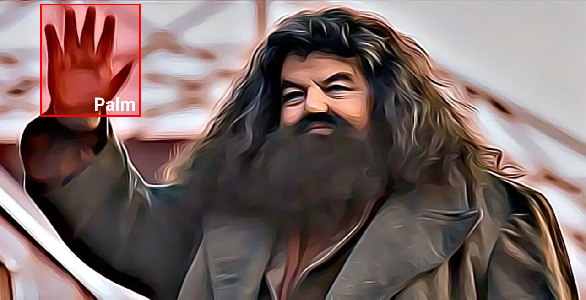
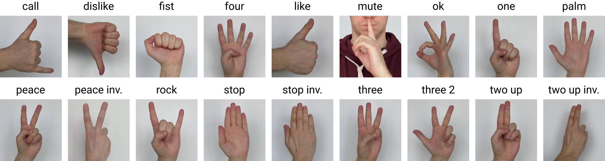
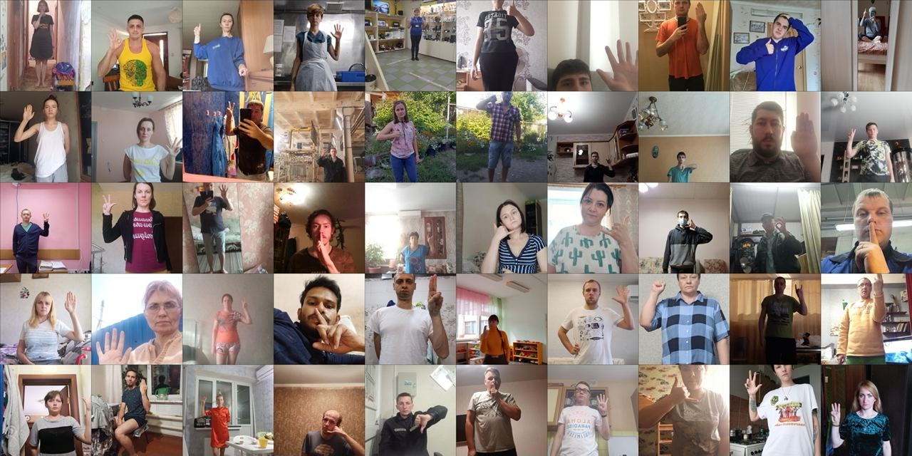
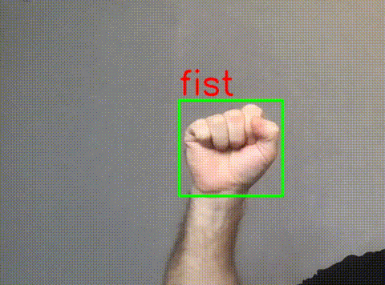

# HaGRID - HAnd Gesture Recognition Image Dataset



We introduce a large image dataset **HaGRID** (**HA**nd **G**esture **R**ecognition **I**mage **D**ataset) for hand gesture recognition (HGR) systems. You can use it for image classification or image detection tasks. Proposed dataset allows to build HGR systems, which can be used in video conferencing services (Zoom, Skype, Discord, Jazz etc.), home automation systems, the automotive sector, etc.

HaGRID size is **716GB** and dataset contains **552,992** FullHD (1920 × 1080) RGB images divided into **18** classes of gestures. Also, some images have `no_gesture` class if there is a second free hand in the frame. This extra class contains **123,589** samples. The data were split into training 92%, and testing 8% sets by subject `user_id`, with 509,323 images for train and 43,669 images for test.



The dataset contains **34,730** unique persons and at least this number of unique scenes. The subjects are people from 18 to 65 years old. The dataset was collected mainly indoors with considerable variation in lighting, including artificial and natural light. Besides, the dataset includes images taken in extreme conditions such as facing and backing to a window. Also, the subjects had to show gestures at a distance of 0.5 to 4 meters from the camera.

Example of sample and its annotation:



For more information see our arxiv paper [HaGRID - HAnd Gesture Recognition Image Dataset](https://arxiv.org/abs/2206.08219).

## Installation
Clone and install required python packages:
```bash
git clone https://github.com/hukenovs/hagrid.git
# or mirror link:
cd hagrid
# Create virtual env by conda or venv
conda create -n gestures python=3.9 -y
conda activate gestures
# Install requirements
pip install -r requirements.txt
```

### Docker Installation
```bash
docker build -t gestures .
docker run -it -d -v $PWD:/gesture-classifier gestures
```

## Downloads
We split the train dataset into 18 archives by gestures because of the large size of data. Download and unzip them from the following links:

### Tranval

| Gesture                           | Size     | Gesture                                   | Size    |
|-----------------------------------|----------|-------------------------------------------|---------|
| [`call`](https://sc.link/ykEn)    | 39.1 GB  | [`peace`](https://sc.link/l6nM)           | 38.6 GB |
| [`dislike`](https://sc.link/xjDB) | 38.7 GB  | [`peace_inverted`](https://sc.link/mXoG)  | 38.6 GB |
| [`fist`](https://sc.link/wgB8)    | 38.0 GB  | [`rock`](https://sc.link/kMm6)            | 38.9 GB |
| [`four`](https://sc.link/vJA5)    | 40.5 GB  | [`stop`](https://sc.link/gXgk)            | 38.3 GB |
| [`like`](https://sc.link/r7wp)    | 38.3 GB  | [`stop_inverted`](https://sc.link/jJlv)   | 40.2 GB |
| [`mute`](https://sc.link/q8vp)    | 39.5 GB  | [`three`](https://sc.link/wgBr)           | 39.4 GB |
| [`ok`](https://sc.link/pV0V)      | 39.0 GB  | [`three2`](https://sc.link/vJA8)          | 38.5 GB |
| [`one`](https://sc.link/oJqX)     | 39.9 GB  | [`two_up`](https://sc.link/q8v7)          | 41.2 GB |
| [`palm`](https://sc.link/nJp7)    | 39.3 GB  | [`two_up_inverted`](https://sc.link/r7w2) | 39.2 GB |

`train_val` **annotations**: [`ann_train_val`](https://sc.link/BE5Y)

### Test

| Test        | Archives                            | Size      |
|-------------|-------------------------------------|-----------|
| images      | [`test`](https://sc.link/zlGy)      | 60.4 GB   |
| annotations | [`ann_test`](https://sc.link/DE5K)  | 3.4 MB    |

### Subsample
Subsample has 100 items per gesture.

| Subsample   | Archives                                | Size      |
|-------------|-----------------------------------------|-----------|
| images      | [`subsample`](https://sc.link/AO5l)     | 2.5 GB    |
| annotations | [`ann_subsample`](https://sc.link/EQ5g) | 153.8 KB  |

or by using python script
```bash
python download.py --save_path <PATH_TO_SAVE> \
                   --train \
                   --test \
                   --subset \
                   --annotations \
                   --dataset
```

Run the following command with key `--subset` to download the small subset (100 images per class). You can download the
train subset with `--trainval` or test subset with `--test`. Download annotations for selected stage by `--annotations` key. Download dataset with images by `--dataset`.

```bash
usage: download.py [-h] [--train] [--test] [--subset] [-a] [-d] [-t TARGETS [TARGETS ...]] [-p SAVE_PATH]

Download dataset...

optional arguments:
  -h, --help            show this help message and exit
  --train               Download trainval set
  --test                Download test set
  --subset              Download subset with 100 items of each gesture
  -a, --annotations     Download annotations
  -d, --dataset         Download dataset
  -t TARGETS [TARGETS ...], --targets TARGETS [TARGETS ...]
                        Target(s) for downloading train set
  -p SAVE_PATH, --save_path SAVE_PATH
                        Save path
```

## Models
We provide some pre-trained models as the baseline with the classic backbone architectures and two output heads - for gesture classification and leading hand classification.

| Classifiers                               | F1 Gestures | F1 Leading hand |
|-------------------------------------------|-------------|-----------------|
| [ResNet18](https://sc.link/KEnx)          | 98.72       | 99.27           |
| [ResNet152](https://sc.link/O9rr)         | 99.11       | **99.45**       |
| [ResNeXt50](https://sc.link/GKjJ)         | 98.99       | 99.39           |
| [ResNeXt101](https://sc.link/JXmg)        | **99.28**   | 99.28           |
| [MobileNetV3_small](https://sc.link/XVEg) | 96.78       | 98.28           |
| [MobileNetV3_large](https://sc.link/YXG2) | 97.88       | 98.58           |
| [Vitb32](https://sc.link/XV4g)            | 98.49       | 99.13           |

Also we provide SSDLite model with MobileNetV3 large backbone to solve hand detection problem.

| Detector                        | mAP   |
|---------------------------------|-------|
| [SSDLite](https://sc.link/YXg2) | 71.49 |

## Train

You can use downloaded trained models, otherwise select a classifier and parameters for training in `default.yaml`.
To train the model, execute the following command:

```bash
python -m classifier.run --command 'train' --path_to_config <PATH>
```

Every step, the current loss, learning rate and others values get logged to **Tensorboard**.
See all saved metrics and parameters by opening a command line (this will open a webpage at `localhost:6006`):
```bash
tensorboard --logdir=experiments
```

## Test
Test your model by running the following command:
```bash
python -m classifier.run --command 'test' --path_to_config <PATH>
```

## Demo
 ```bash
python demo.py -p <PATH_TO_DETECTOR>
```


## Annotations

The annotations consist of bounding boxes of hands in COCO format `[top left X position, top left Y position, width, height]` with gesture labels. Also annotations have markups of `leading hands` (`left` or `right` for gesture hand) and `leading_conf` as confidence for `leading_hand` annotation. We provide `user_id` field that will allow you to split the train / val dataset yourself.
```json
"03487280-224f-490d-8e36-6c5f48e3d7a0": {
  "bboxes": [
    [0.0283366, 0.8686061, 0.0757000, 0.1149820],
    [0.6824319, 0.2661254, 0.1086447, 0.1481245]
  ],
  "labels": [
    "no_gesture",
    "one"
  ],
  "leading_hand": "left",
  "leading_conf": 1.0,
  "user_id": "bb138d5db200f29385f..."
}
```
- Key - image name without extension
- Bboxes - list of normalized bboxes `[top left X pos, top left Y pos, width, height]`
- Labels - list of class labels e.g. `like`, `stop`, `no_gesture`
- Leading hand - `right` or `left` for hand which showing gesture
- Leading conf - leading confidence for `leading_hand`
- User ID - subject id (useful for split data to train / val subsets).

### Bounding boxes

| Object       | Train + Val | Test    | Total   |
|--------------|-------------|---------|---------|
| gesture      | ~ 28 300    | ~ 2 400 | 30 629  |
| no gesture   | 112 740     | 10 849  | 123 589 |
| total boxes  | 622 063     | 54 518  | 676 581 |

### License
<a rel="license" href="http://creativecommons.org/licenses/by-sa/4.0/"></a><br />This work is licensed under a variant of <a rel="license" href="http://creativecommons.org/licenses/by-sa/4.0/">Creative Commons Attribution-ShareAlike 4.0 International License</a>.

Please see the specific [license](https://github.com/hukenovs/hagrid/blob/master/license/en_us.pdf).

### Authors and Credits
- [Alexander Kapitanov](https://www.linkedin.com/in/hukenovs)
- [Andrey Makhlyarchuk](https://www.linkedin.com/in/makhliarchuk)
- [Karina Kvanchiani](https://www.linkedin.com/in/kvanchiani)

### Links
- [Github](https://github.com/hukenovs/hagrid)
- [Mirror](https://gitlab.aicloud.sbercloud.ru/rndcv/hagrid)
- [arXiv](https://arxiv.org/abs/2206.08219)
- [Kaggle](https://www.kaggle.com/datasets/kapitanov/hagrid)
- [Habr](https://habr.com/ru/company/sberdevices/blog/671614/)
- [Paperswithcode](https://paperswithcode.com/paper/hagrid-hand-gesture-recognition-image-dataset)

### Citation
You can cite the paper using the following BibTeX entry:

    @article{hagrid,
        title={HaGRID - HAnd Gesture Recognition Image Dataset},
        author={Kapitanov, Alexander and Makhlyarchuk, Andrey and Kvanchiani, Karina},
        journal={arXiv preprint arXiv:2206.08219},
        year={2022}
    }
