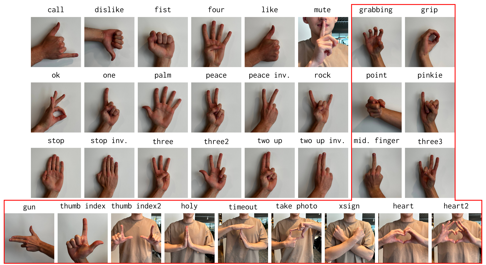
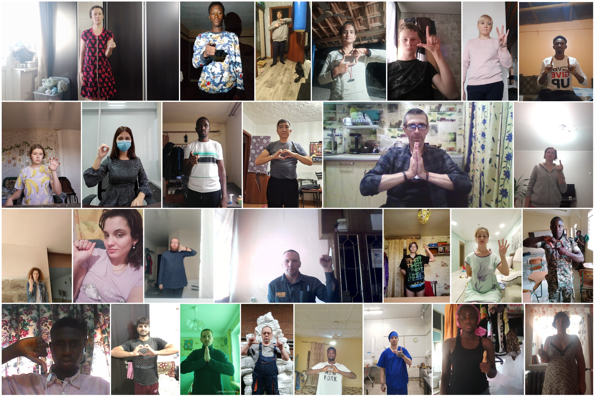

# HaGRID - HAnd Gesture Recognition Image Dataset


We introduce a large image dataset **HaGRIDv2** (**HA**nd **G**esture **R**ecognition **I**mage **D**ataset) for hand gesture recognition (HGR) systems. You can use it for image classification or image detection tasks. Proposed dataset allows to build HGR systems, which can be used in video conferencing services (Zoom, Skype, Discord, Jazz etc.), home automation systems, the automotive sector, etc.

HaGRIDv2 size is **1.5T** and dataset contains **1,086,158** FullHD RGB images divided into **33** classes of gestures and a new separate "no_gesture" class, containing domain-specific natural hand postures. Also, some images have `no_gesture` class if there is a second gesture-free hand in the frame. This extra class contains **2,164** samples. The data were split into training 76%, 9% validation and testing 15% sets by subject `user_id`, with 821,458 images for train, 99,200 images for validation and 165,500 for test.



The dataset contains **65,977** unique persons and at least this number of unique scenes. The subjects are people over 18 years old. The dataset was collected mainly indoors with considerable variation in lighting, including artificial and natural light. Besides, the dataset includes images taken in extreme conditions such as facing and backing to a window. Also, the subjects had to show gestures at a distance of 0.5 to 4 meters from the camera.

Example of sample and its annotation:



For more information see our arxiv paper [TBA]().

## 🔥 Changelog
- **`2024/09/24`**: We release [HaGRIDv2](https://github.com/hukenovs/hagrid/tree/Hagrid_v2-1M). 🙏
  - The HaGRID dataset has been expanded with 15 new gesture classes, including two-handed gestures
  - New class "no_gesture" with domain-specific natural hand postures was addad (**2,164** samples, divided by train/val/test containing 1,464, 200, 500 images, respectively)
  - Extra class `no_gesture` contains **200,390** bounding boxes
  - Added new models for gesture detection, hand detection and full-frame classification
  - Dataset size is **1.5T**
  - **1,086,158** FullHD RGB images
  - Train/val/test split: (821,458) **76%** / (99,200) **9%** / (165,500) **15%** by subject `user_id`
  - **65,977** unique persons
- **`2023/09/21`**: We release [HaGRID 2.0.](https://github.com/hukenovs/hagrid/tree/Hagrid_v2) ✌️
  - All files for training and testing are combined into one directory
  - The data was further cleared and new ones were added
  - Multi-gpu training and testing
  - Added new models for detection and full-frame classification
  - Dataset size is **723GB**
  - **554,800** FullHD RGB images (cleaned and updated classes, added diversity by race)
  - Extra class `no_gesture` contains **120,105** samples
  - Train/val/test split: (410,800) **74%** / (54,000) **10%** / (90,000) **16%** by subject `user_id`
  - **37,583** unique persons
- **`2022/06/16`**: [HaGRID (Initial Dataset)](https://github.com/hukenovs/hagrid/tree/Hagrid_v1) 💪
  - Dataset size is **716GB**
  - **552,992** FullHD RGB images divided into **18** classes
  - Extra class `no_gesture` contains **123,589** samples
  - Train/test split: (509,323) **92%** / (43,669) **8%** by subject `user_id`
  - **34,730** unique persons from 18 to 65 years old
  - The distance is 0.5 to 4 meters from the camera

## Installation
Clone and install required python packages:
```bash
git clone https://github.com/hukenovs/hagrid.git
# or mirror link:
cd hagrid
# Create virtual env by conda or venv
conda create -n gestures python=3.11 -y
conda activate gestures
# Install requirements
pip install -r requirements.txt
```

## Downloads
We split the train dataset into 34 archives by gestures because of the large size of data. Download and unzip them from the following links:

### Dataset

| Gesture                           | Size    | Gesture                                   | Size    | Gesture | Size
|-----------------------------------|---------|-------------------------------------------|---------|--------|----|
| [`call`](https://rndml-team-cv.obs.ru-moscow-1.hc.sbercloud.ru/datasets/hagrid/hagrid_dataset_new_554800/hagrid_dataset/call.zip)    | 37.2 GB | [`peace`](https://rndml-team-cv.obs.ru-moscow-1.hc.sbercloud.ru/datasets/hagrid/hagrid_dataset_new_554800/hagrid_dataset/peace.zip)           | 41.4 GB | [`grabbing`](https://rndml-team-cv.obs.ru-moscow-1.hc.sbercloud.ru/datasets/hagrid_v2/hagrid_v2_zip/grabbing.zip) | 48.7 GB
| [`dislike`](https://rndml-team-cv.obs.ru-moscow-1.hc.sbercloud.ru/datasets/hagrid/hagrid_dataset_new_554800/hagrid_dataset/dislike.zip) | 40.9 GB | [`peace_inverted`](https://rndml-team-cv.obs.ru-moscow-1.hc.sbercloud.ru/datasets/hagrid/hagrid_dataset_new_554800/hagrid_dataset/peace_inverted.zip)  | 40.5 GB | [`grip`](https://rndml-team-cv.obs.ru-moscow-1.hc.sbercloud.ru/datasets/hagrid_v2/hagrid_v2_zip/grip.zip) | 48.6 GB
| [`fist`](https://rndml-team-cv.obs.ru-moscow-1.hc.sbercloud.ru/datasets/hagrid/hagrid_dataset_new_554800/hagrid_dataset/fist.zip)    | 42.3 GB | [`rock`](https://rndml-team-cv.obs.ru-moscow-1.hc.sbercloud.ru/datasets/hagrid_v2/hagrid_v2_zip/rock.zip)            | 41.7 GB | [`hand_heart`](https://rndml-team-cv.obs.ru-moscow-1.hc.sbercloud.ru/datasets/hagrid_v2/hagrid_v2_zip/hand_heart.zip) | 39.6 GB
| [`four`](https://rndml-team-cv.obs.ru-moscow-1.hc.sbercloud.ru/datasets/hagrid/hagrid_dataset_new_554800/hagrid_dataset/four.zip)    | 43.1 GB | [`stop`](https://rndml-team-cv.obs.ru-moscow-1.hc.sbercloud.ru/datasets/hagrid/hagrid_dataset_new_554800/hagrid_dataset/stop.zip)            | 41.8 GB | [`hand_heart2`](https://rndml-team-cv.obs.ru-moscow-1.hc.sbercloud.ru/datasets/hagrid_v2/hagrid_v2_zip/hand_heart2.zip) | 42.6 GB
| [`like`](https://rndml-team-cv.obs.ru-moscow-1.hc.sbercloud.ru/datasets/hagrid/hagrid_dataset_new_554800/hagrid_dataset/like.zip)    | 42.2 GB | [`stop_inverted`](https://rndml-team-cv.obs.ru-moscow-1.hc.sbercloud.ru/datasets/hagrid/hagrid_dataset_new_554800/hagrid_dataset/stop_inverted.zip)   | 41.4 GB | [`holy`](https://rndml-team-cv.obs.ru-moscow-1.hc.sbercloud.ru/datasets/hagrid_v2/hagrid_v2_zip/holy.zip) | 52.7 GB
 | [`mute`](https://rndml-team-cv.obs.ru-moscow-1.hc.sbercloud.ru/datasets/hagrid/hagrid_dataset_new_554800/hagrid_dataset/mute.zip)    | 43.2 GB | [`three`](https://rndml-team-cv.obs.ru-moscow-1.hc.sbercloud.ru/datasets/hagrid/hagrid_dataset_new_554800/hagrid_dataset/three.zip)           | 42.2 GB | [`little_finger`](https://rndml-team-cv.obs.ru-moscow-1.hc.sbercloud.ru/datasets/hagrid_v2/hagrid_v2_zip/little_finger.zip) | 48.6 GB
| [`ok`](https://rndml-team-cv.obs.ru-moscow-1.hc.sbercloud.ru/datasets/hagrid/hagrid_dataset_new_554800/hagrid_dataset/ok.zip)      | 42.5 GB | [`three2`](https://rndml-team-cv.obs.ru-moscow-1.hc.sbercloud.ru/datasets/hagrid/hagrid_dataset_new_554800/hagrid_dataset/three2.zip)          | 40.2 GB | [`middle_finger`](https://rndml-team-cv.obs.ru-moscow-1.hc.sbercloud.ru/datasets/hagrid_v2/hagrid_v2_zip/middle_finger.zip) | 50.5 GB
| [`one`](https://rndml-team-cv.obs.ru-moscow-1.hc.sbercloud.ru/datasets/hagrid_v2/hagrid_v2_zip/one.zip)     | 42.7 GB | [`two_up`](https://rndml-team-cv.obs.ru-moscow-1.hc.sbercloud.ru/datasets/hagrid/hagrid_dataset_new_554800/hagrid_dataset/two_up.zip)          | 41.8 GB | [`point`](https://rndml-team-cv.obs.ru-moscow-1.hc.sbercloud.ru/datasets/hagrid_v2/hagrid_v2_zip/point.zip) | 50.4 GB
| [`palm`](https://rndml-team-cv.obs.ru-moscow-1.hc.sbercloud.ru/datasets/hagrid/hagrid_dataset_new_554800/hagrid_dataset/palm.zip)    | 43.0 GB | [`two_up_inverted`](https://rndml-team-cv.obs.ru-moscow-1.hc.sbercloud.ru/datasets/hagrid/hagrid_dataset_new_554800/hagrid_dataset/two_up_inverted.zip) | 40.9 GB | [`take_picture`](https://rndml-team-cv.obs.ru-moscow-1.hc.sbercloud.ru/datasets/hagrid_v2/hagrid_v2_zip/take_picture.zip) | 37.3 GB
| [`three3`](https://rndml-team-cv.obs.ru-moscow-1.hc.sbercloud.ru/datasets/hagrid_v2/hagrid_v2_zip/three3.zip) | 54 GB | [`three_gun`](https://rndml-team-cv.obs.ru-moscow-1.hc.sbercloud.ru/datasets/hagrid_v2/hagrid_v2_zip/three_gun.zip) | 50.1 GB | [`thumb_index`](https://rndml-team-cv.obs.ru-moscow-1.hc.sbercloud.ru/datasets/hagrid_v2/hagrid_v2_zip/thumb_index.zip) | 62.8 GB
| [`thumb_index2`](https://rndml-team-cv.obs.ru-moscow-1.hc.sbercloud.ru/datasets/hagrid_v2/hagrid_v2_zip/thumb_index2.zip) | 24.8 GB | [`timeout`](https://rndml-team-cv.obs.ru-moscow-1.hc.sbercloud.ru/datasets/hagrid_v2/hagrid_v2_zip/timeout.zip) | 39.5 GB | [`xsign`](https://rndml-team-cv.obs.ru-moscow-1.hc.sbercloud.ru/datasets/hagrid_v2/hagrid_v2_zip/xsign.zip) | 51.3 GB
| [`no_gesture`](https://rndml-team-cv.obs.ru-moscow-1.hc.sbercloud.ru/datasets/hagrid_v2/hagrid_v2_zip/no_gesture.zip) | 493.9 MB

`dataset` **annotations**: [`annotations`](https://rndml-team-cv.obs.ru-moscow-1.hc.sbercloud.ru/datasets/hagrid_v2/annotations_with_landmarks/annotations.zip)

[HaGRIDv2 512px - lightweight version of the full dataset with](https://rndml-team-cv.obs.ru-moscow-1.hc.sbercloud.ru/datasets/hagrid_v2/hagridv2_512.zip) `min_side = 512p` `119.4 GB`

or by using python script
```bash
python download.py --save_path <PATH_TO_SAVE> \
                   --annotations \
                   --dataset
```

Run the following command with key `--dataset` to download dataset with images. Download annotations for selected stage by `--annotations` key.

```bash
usage: download.py [-h] [-a] [-d] [-t TARGETS [TARGETS ...]] [-p SAVE_PATH]

Download dataset...

optional arguments:
  -h, --help            show this help message and exit
  -a, --annotations     Download annotations
  -d, --dataset         Download dataset
  -t TARGETS [TARGETS ...], --targets TARGETS [TARGETS ...]
                        Target(s) for downloading train set
  -p SAVE_PATH, --save_path SAVE_PATH
                        Save path
```
After downloading, you can unzip the archive by running the following command:
```bash
unzip <PATH_TO_ARCHIVE> -d <PATH_TO_SAVE>
```
The structure of the dataset is as follows:
```
├── hagrid_dataset <PATH_TO_DATASET_FOLDER>
│   ├── call
│   │   ├── 00000000.jpg
│   │   ├── 00000001.jpg
│   │   ├── ...
├── hagrid_annotations
│   ├── train <PATH_TO_JSON_TRAIN>
│   │   ├── call.json
│   │   ├── ...
│   ├── val <PATH_TO_JSON_VAL>
│   │   ├── call.json
│   │   ├── ...
│   ├── test <PATH_TO_JSON_TEST>
│   │   ├── call.json
│   │   ├── ...
```

## Models
We provide some models pre-trained on HaGRIDv2 as the baseline with the classic backbone architectures for gesture classification, gesture detection and hand detection.

| Gesture Detectors                                         | mAP      |
|--------------------------------------------------|----------|
| [YOLOv10x](https://rndml-team-cv.obs.ru-moscow-1.hc.sbercloud.ru/datasets/hagrid_v2/models/YOLOv10x_gestures.pt)  | **89.4**     |
| [YOLOv10n](https://rndml-team-cv.obs.ru-moscow-1.hc.sbercloud.ru/datasets/hagrid_v2/models/YOLOv10n_gestures.pt)  | 88.2     |
| [SSDLiteMobileNetV3Large](https://rndml-team-cv.obs.ru-moscow-1.hc.sbercloud.ru/datasets/hagrid_v2/models/SSDLiteMobileNetV3Large.pth) | 72.7 |

In addition, if you need to detect hands, you can use YOLO detection models, pre-trained on HaGRIDv2

| Hand Detectors                                         | mAP      |
|--------------------------------------------------|----------|
| [YOLOv10x](https://rndml-team-cv.obs.ru-moscow-1.hc.sbercloud.ru/datasets/hagrid_v2/models/YOLOv10x_hands.pt)  | **88.8**     |
| [YOLOv10n](https://rndml-team-cv.obs.ru-moscow-1.hc.sbercloud.ru/datasets/hagrid_v2/models/YOLOv10n_hands.pt)  | 87.9     |


However, if you need a single gesture, you can use pre-trained full frame classifiers instead of detectors.
To use full frame models, **remove the no_gesture class**

| Full Frame Classifiers                    | F1 Gestures |
|-------------------------------------------|---------|
| [MobileNetV3_small](https://rndml-team-cv.obs.ru-moscow-1.hc.sbercloud.ru/datasets/hagrid_v2/models/MobileNetV3_small.pth) | 86.7    |
| [MobileNetV3_large](https://rndml-team-cv.obs.ru-moscow-1.hc.sbercloud.ru/datasets/hagrid_v2/models/MobileNetV3_large.pth) | 93.4    |
| [VitB16](https://rndml-team-cv.obs.ru-moscow-1.hc.sbercloud.ru/datasets/hagrid_v2/models/VitB16.pth) | 91.7    |
| [ResNet18](https://rndml-team-cv.obs.ru-moscow-1.hc.sbercloud.ru/datasets/hagrid_v2/models/ResNet18.pth)      | 98.3    |
| [ResNet152](https://rndml-team-cv.obs.ru-moscow-1.hc.sbercloud.ru/datasets/hagrid_v2/models/ResNet152.pth)    | **98.6**    |
| [ConvNeXt base](https://rndml-team-cv.obs.ru-moscow-1.hc.sbercloud.ru/datasets/hagrid_v2/models/ConvNeXt_base.pth)    | 96.4 |


<details><summary><h3>Train</h3></summary>

You can use downloaded trained models, otherwise select a parameters for training in `configs` folder.
To train the model, execute the following command:

Single GPU:

```bash
python run.py -c train -p configs/<config>
```
Multi GPU:
```bash
bash ddp_run.sh -g 0,1,2,3 -c train -p configs/<config>
```
which -g is a list of GPU ids.


Every step, the current loss, learning rate and others values get logged to **Tensorboard**.
See all saved metrics and parameters by opening a command line (this will open a webpage at `localhost:6006`):
```bash
tensorboard --logdir=<workdir>
```
</details>
<details><summary><h3>Test</h3></summary>

Test your model by running the following command:

Single GPU:

```bash
python run.py -c test -p configs/<config>
```
Multi GPU:
```bash
bash ddp_run.sh -g 0,1,2,3 -c test -p configs/<config>
```
which -g is a list of GPU ids.
</details>

## Demo
 ```bash
python demo.py -p <PATH_TO_CONFIG> --landmarks
```


## Demo Full Frame Classifiers
 ```bash
python demo_ff.py -p <PATH_TO_CONFIG>
```

## Annotations

The annotations consist of bounding boxes of hands and gestures in COCO format `[top left X position, top left Y position, width, height]` with gesture labels. We provide `user_id` field that will allow you to split the train / val / test dataset yourself, as well as a meta-informations contains automatically annotated age, gender and race.
```json
"04c49801-1101-4b4e-82d0-d4607cd01df0": {
    "bboxes": [
        [0.0694444444, 0.3104166667, 0.2666666667, 0.2640625],
        [0.5993055556, 0.2875, 0.2569444444, 0.2760416667]
    ],
    "labels": [
        "thumb_index2",
        "thumb_index2"
    ],
    "united_bbox": [
        [0.0694444444, 0.2875, 0.7868055556, 0.2869791667]
    ],
    "united_label": [
        "thumb_index2"
    ],
    "user_id": "2fe6a9156ff8ca27fbce8ada318c592b",
    "hand_landmarks": [
            [
                [0.37233507701702123, 0.5935673528948108],
                [0.3997604810145188, 0.5925499847441514],
                ...
            ],
            [
                [0.37388438145820907, 0.47547576284667353],
                [0.39460467775730607, 0.4698847093520443],
                ...
            ]
        ]
    "meta": {
        "age": [24.41],
        "gender": ["female"],
        "race": ["White"]
    }
```
- Key - image name without extension
- Bboxes - list of normalized bboxes for each hand `[top left X pos, top left Y pos, width, height]`
- Labels - list of class labels for each hand e.g. `like`, `stop`, `no_gesture`
- United_bbox - united combination of two hand boxes in the case of two-handed gestures ("hand_heart", "hand_heart2", "thumb_index2", "timeout", "holy", "take_picture", "xsign") and 'null' in the case of one-handed gestures
- United_label - a class label for united_bbox in case of two-handed gestures and 'null' in the case of one-handed gestures
- User ID - subject id (useful for split data to train / val subsets).
- Hand_landmarks - auto-annotated with MediaPipe landmarks for each hand.
- Meta - automatically annotated with FairFace and MiVOLO neural networks meta-information contains age, gender and race


### Bounding boxes

| Object       | Train       | Val     | Test    |Total    |
|--------------|-------------|---------|---------|---------|
| gesture      | 980 924     | 120 003 | 200 006 |1 300 933|
| no gesture   | 154 403     | 19 411  | 29 386  | 203 200 |
| total boxes  | 1 135 327   | 139 414 | 229 392 |1 504 133|

### Landmarks

| Object                    | Train       | Val     | Test    |Total    |
|---------------------------|-------------|---------|---------|---------|
|Total hands with landmarks |  983 991    | 123 230 |201 131  |1 308 352|


### Converters

<details><summary> <b>Yolo</b> </summary>

We provide a script to convert annotations to [YOLO](https://pjreddie.com/darknet/yolo/) format. To convert annotations, run the following command:

```bash
python -m converters.hagrid_to_yolo --cfg <CONFIG_PATH> --mode <'hands' or 'gestures'>
```

after conversion, you need change original definition [img2labels](https://github.com/WongKinYiu/yolov7/blob/2fdc7f14395f6532ad05fb3e6970150a6a83d290/utils/datasets.py#L347-L350) to:

```python
def img2label_paths(img_paths):
    img_paths = list(img_paths)
    # Define label paths as a function of image paths
    if "train" in img_paths[0]:
        return [x.replace("train", "train_labels").replace(".jpg", ".txt") for x in img_paths]
    elif "test" in img_paths[0]:
        return [x.replace("test", "test_labels").replace(".jpg", ".txt") for x in img_paths]
    elif "val" in img_paths[0]:
        return [x.replace("val", "val_labels").replace(".jpg", ".txt") for x in img_paths]
```

</details>


<details><summary> <b>Coco</b> </summary>

Also, we provide a script to convert annotations to [Coco](https://cocodataset.org/#home) format. To convert annotations, run the following command:

```bash
python -m converters.hagrid_to_coco --cfg <CONFIG_PATH> --mode <'hands' or 'gestures'>
```

</details>

### License
<a rel="license" href="http://creativecommons.org/licenses/by-sa/4.0/"></a><br />This work is licensed under a variant of <a rel="license" href="http://creativecommons.org/licenses/by-sa/4.0/">Creative Commons Attribution-ShareAlike 4.0 International License</a>.

Please see the specific [license](https://github.com/hukenovs/hagrid/blob/master/license/en_us.pdf).

### Authors and Credits
- [Alexander Kapitanov](https://www.linkedin.com/in/hukenovs)
- [Andrey Makhlyarchuk](https://www.linkedin.com/in/makhliarchuk)
- [Karina Kvanchiani](https://www.linkedin.com/in/kvanchiani)
- [Aleksandr Nagaev](https://www.linkedin.com/in/nagadit)
- [Roman Kraynov](https://ru.linkedin.com/in/roman-kraynov-25ab44265)
- [Anton Nuzhdin](https://www.linkedin.com/in/anton-nuzhdin-46b799234 )

### Links
- [Github](https://github.com/hukenovs/hagrid)
<!-- - [Mirror](https://gitlab.aicloud.sbercloud.ru/rndcv/hagrid) -->
- [arXiv](https://arxiv.org/abs/2206.08219)
<!-- - [Kaggle](https://www.kaggle.com/datasets/kapitanov/hagrid) -->
<!-- - [Habr](https://habr.com/ru/company/sberdevices/blog/671614/) -->
<!-- - [Paperswithcode](https://paperswithcode.com/paper/hagrid-hand-gesture-recognition-image-dataset) -->

### Citation
You can cite the paper using the following BibTeX entry:

    @InProceedings{Kapitanov_2024_WACV,
        author    = {Kapitanov, Alexander and Kvanchiani, Karina and Nagaev, Alexander and Kraynov, Roman and Makhliarchuk, Andrei},
        title     = {HaGRID -- HAnd Gesture Recognition Image Dataset},
        booktitle = {Proceedings of the IEEE/CVF Winter Conference on Applications of Computer Vision (WACV)},
        month     = {January},
        year      = {2024},
        pages     = {4572-4581}
    }
